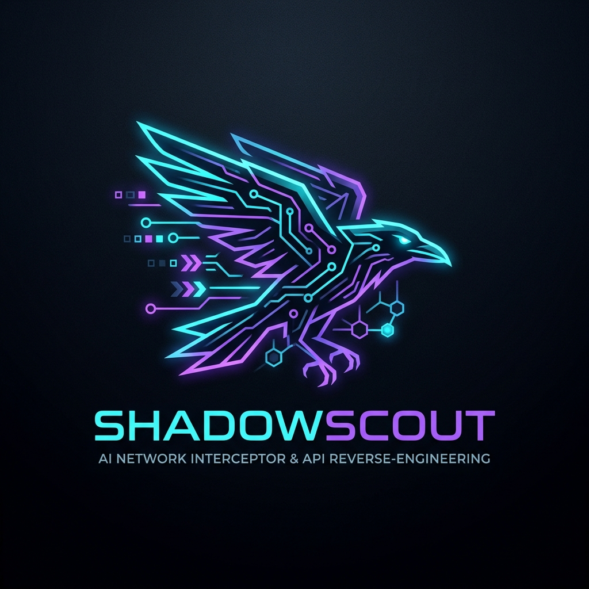

<div align="center">



# ⚡ ShadowScout

### Autonomous Hidden API Reverse-Engineering & High-Speed Scraper Synthesizer

[](https://www.python.org/)
[](https://opensource.org/licenses/Apache-2.0)
[](https://playwright.dev/)
[](https://docs.pydantic.dev/)
[](https://modelcontextprotocol.io/)

*Browse once. Discover hidden backend APIs. Generate standalone, zero-browser Python scrapers with native HTTP throughput.*

---

[Key Features](#-key-features--production-architecture) •
[Quickstart](#-quickstart) •
[Architecture](#-architecture) •
[Interactive Demo](#-10-second-zero-config-demo) •
[MCP Integration](#-model-context-protocol-mcp-server) •
[Contributing](#-contributing)

</div>

---

## 📌 The Problem: Why Traditional Scrapers Break

The open-source web scraping landscape is polarized into two inefficient extremes:
1. **DOM Parsing & Markdown Extractors** (`Crawl4AI`, `Firecrawl`): They dump the entire HTML, convert it to Markdown, and feed 50,000+ tokens into an LLM. When modern websites update their CSS classes, selectors break instantly.
2. **Visual Browsing AI Agents** (`Browser-Use`, `Skyvern`): They use vision models to inspect screenshots and click buttons. While versatile for complex forms, they are **prohibitively slow** (5–15 seconds per page) and **expensive** ($0.05–$0.20 per navigation).

### 💡 The ShadowScout Solution: Autonomous API Reverse-Engineering

Modern dynamic Single Page Applications (Next.js, Nuxt, React, Vue) **rarely embed data directly in HTML**. Instead, client-side JavaScript queries clean backend REST / GraphQL JSON endpoints.

**ShadowScout** operates as an intelligent on-call reverse-engineering agent:
* **Observes**: Drives Playwright to trigger dynamic client-side fetches, infinite scrolls, and pagination clicks.
* **Filters**: Intercepts Chrome DevTools Protocol (CDP) traffic, stripping 95%+ tracking noise (GA4, Sentry, Datadog, TikTok, Meta Pixel).
* **Scores**: Employs a **Tabular Data Density Heuristic** to isolate primary domain APIs from UI configurations or translations.
* **Prunes**: Performs **Ablative Header & Cookie Testing** via `httpx` with semantic equivalence checks (validates status code, response body structure, and error-free JSON).
* **Synthesizes**: Generates a standalone, fully-typed `httpx` Python scraper (`scraper.py`) and an industry-standard **OpenAPI 3.1 specification**.
* **Self-Verifies**: Executes a subprocess test gate (`--test-run`) before handing code to the user, guaranteeing **100% runnable code**.

---

## ⚡ Comparison: ShadowScout vs Existing Frameworks

| Benchmark / Metric | Visual Agents (`Browser-Use` / `Skyvern`) | DOM/Markdown (`Crawl4AI` / `Firecrawl`) | `ShadowScout` |
|---|---|---|---|
| **Production Runtime** | Heavy Headless Chromium | Headless Chromium Required | **Zero Browser (`httpx` only)** |
| **Request Latency** | 3,000ms – 15,000ms | 1,000ms – 4,000ms | **10ms – 50ms (Up to 10x-50x faster)** |
| **Token Cost in Production** | High ($0.05 - $0.50 per page) | Medium (Markdown context) | **$0.00 (Zero tokens in runtime)** |
| **Immunity to UI Redesigns** | ❌ Fragile (UI drift breaks clicks) | ❌ Fragile (CSS class updates break DOM) | **✅ Immune (Target stable backend API)** |
| **Deliverable** | Agent conversation transcript | Raw Markdown / HTML dump | **Standalone `.py` + `openapi.json`** |
| **Container Size** | ~1.5 GB Docker Image | ~1.2 GB Docker Image | **~60 MB Minimal Python Container** |

---

## 🏗️ Architecture

```
                    ┌──────────────────────────────────────────────┐
                    │  Target URL (e.g. Dynamic SPA / Portal)      │
                    └──────────────────────┬───────────────────────┘
                                           │
                                           ▼
                    ┌──────────────────────────────────────────────┐
                    │ 1. Intercept & Filter Noise (Playwright/CDP) │
                    │    - Deterministic Regex Filter (50+ SDKs)   │
                    │    - Discards GA4, Datadog, Sentry, Pixels   │
                    │    - Captures raw XHR/Fetch JSON streams     │
                    └──────────────────────┬───────────────────────┘
                                           │
                                           ▼
                    ┌──────────────────────────────────────────────┐
                    │ 2. Tabular Density Scorer & Fuzzer           │
                    │    - Ranks JSON arrays by key entropy & size │
                    │    - Ablative header & cookie elimination    │
                    │    - Detects pagination (page, offset, cursor│
                    └──────────────────────┬───────────────────────┘
                                           │
                                           ▼
                    ┌──────────────────────────────────────────────┐
                    │ 3. Code Synthesizer & Verification Gate      │
                    │    - Generates Pydantic V2 data model        │
                    │    - Synthesizes standalone async scraper.py │
                    │    - Exports OpenAPI 3.1 specification       │
                    │    - Subprocess execution test (exit code 0) │
                    └──────────────────────────────────────────────┘
```

---

## 🛠️ Key Features & Production Architecture

* 🚀 **Zero-Browser Extraction**: The generated scraper is pure Python with `httpx` connection pooling and async concurrency. No Dockerized Chrome needed in production pipelines.
* 🍪 **Session Cookie & Auth Persistence**: Automatically extracts and persists browser session cookies and auth tokens (`Bearer`, `X-CSRF-Token`, `X-Api-Key`) into the generated scraper.
* 🔄 **Cursor & Page-Based Pagination**: Supports numerical offset/limit, page numbers, and dynamic cursor advancement (extracts and passes `next_cursor` across iteration batches).
* 🧹 **Ablative Header Pruning with Semantic Verification**: Systematically drops browser pseudo-headers and validates that responses remain identical in body structure and error-free.
* 🛡️ **Autonomous Noise Elimination**: Out-of-the-box blocklist for 50+ analytics, tracking, and error-monitoring SDKs (Google Analytics 4, Meta Pixel, Datadog, Sentry, Mixpanel, Hotjar, TikTok Pixel, Cloudflare Web Analytics, New Relic).
* 📐 **Pydantic V2 Schema Auto-Inference**: Automatically analyzes response payloads, handles nullability, sanitizes Python reserved keywords (`from`, `class`, `import`), and outputs strongly-typed data validation classes.
* 📖 **Dual Deliverable (Code + OpenAPI 3.1)**: Reverse-engineers undocumented backend endpoints directly into industry-standard `openapi.json` specs.
* ✅ **Subprocess Self-Verification Gate**: Before returning success, ShadowScout tests its own generated scraper in an isolated subprocess (`--test-run`) to prove non-empty data extraction.
* 🔌 **Real Model Context Protocol (MCP) Server**: Implements standard JSON-RPC 2.0 MCP protocol (`initialize`, `tools/list`, `tools/call`) providing `sniff_url` and `generate_scraper` to Claude Desktop, Cursor, or Antigravity.

---

## 🚀 Quickstart

### Installation

Install via `pip`:
```bash
pip install shadowscout
```

Or using `uv`:
```bash
uv add shadowscout
```

Install the Playwright browser binaries (used exclusively during initial discovery):
```bash
playwright install chromium
```

---

## 🎮 10-Second Zero-Config Demo

Experience ShadowScout instantly without needing any external URLs or API keys. ShadowScout bundles an embedded dynamic SPA e-commerce store with client-side fetching, pagination, and synthetic tracking telemetry:

```bash
shadowscout demo
```

### What happens in the demo:
1. Spins up an in-memory FastAPI mock catalog store at `http://127.0.0.1:8765`.
2. Playwright navigates the page, scrolls, and clicks "Load More".
3. The noise filter intercepts traffic and drops Google Analytics telemetry pings.
4. The scoring engine discovers `/api/v1/products` with a score of **105.0/100**.
5. The ablative fuzzer strips 7 non-essential browser headers.
6. The codegen engine synthesizes `demo_scraper.py` and `demo_openapi.json`.
7. The verification gate executes `python demo_scraper.py --test-run` and confirms **PASSED (100% Runnable)**.

---

## 💻 CLI Usage & Commands

### 1. Reverse-Engineer Any Live Website

```bash
shadowscout sniff https://target-store.com/products -o get_products.py --openapi openapi.json
```

**Options:**
* `-o, --output`: Destination path for synthesized Python scraper (default: `scraper.py`).
* `--openapi`: Export OpenAPI 3.1 specification path (e.g. `openapi.json`).
* `-t, --time`: Observation and scroll simulation time in seconds (default: `4`).
* `--headless / --no-headless`: Run browser with or without visible GUI.
* `--verify / --no-verify`: Run automated subprocess verification test (default: enabled).

### 2. Running Your Synthesized Scraper

The generated script is completely self-contained:

```bash
# Scrape 5 pages and export to JSONL
python scraper.py --pages 5 -o catalog.jsonl

# Scrape and export directly to CSV
python scraper.py --pages 10 -o catalog.csv

# Fast single-page verification test
python scraper.py --test-run
```

---

## 🔌 Model Context Protocol (MCP) Server

ShadowScout can be mounted as an MCP server inside **Claude Desktop**, **Cursor**, or **Antigravity IDE**:

Add the following block to your `claude_desktop_config.json`:

```json
{
  "mcpServers": {
    "shadowscout": {
      "command": "uv",
      "args": ["run", "--package", "shadowscout", "shadowscout", "mcp"]
    }
  }
}
```

### Exposed MCP Tools:
* `mcp_sniff_url`: Intercepts traffic, filters noise, and returns ranked API candidate endpoints.
* `mcp_generate_scraper`: Full end-to-end pipeline that returns validated Python scraper code and OpenAPI 3.1 specifications.

---

## 🧪 Testing & Verification

ShadowScout is built under strict zero-placeholder guidelines and comes with a 100% passing test suite:

```bash
# Run the test suite
uv run pytest
```

```text
tests/test_filters.py ...                                                [ 42%]
tests/test_header_pruner.py .                                            [ 57%]
tests/test_mock_e2e.py .                                                 [ 71%]
tests/test_schema_inferrer.py .                                          [ 85%]
tests/test_scorer.py .                                                   [100%]

============================== 7 passed in 10.04s ==============================
```

---

## 📁 Repository Structure

```text
shadowscout/
├── assets/
│   └── logo.jpg                # Official project emblem
├── src/shadowscout/
│   ├── main.py                 # CLI controller (sniff, demo, mcp)
│   ├── models.py               # Strongly-typed Pydantic V2 domain models
│   ├── interceptor/
│   │   ├── browser.py          # Playwright stealth driver with user simulation
│   │   ├── filters.py          # Deterministic filter for 50+ ad/telemetry SDKs
│   │   └── har_stream.py       # Streaming network capture buffer
│   ├── analyzer/
│   │   └── scorer.py           # Tabular Data Density heuristic scoring
│   ├── fuzzer/
│   │   ├── header_pruner.py    # Ablative header testing for minimal viable cURL
│   │   └── pagination.py       # Parameter discovery & batch limit fuzzing
│   ├── codegen/
│   │   ├── schema_inferrer.py  # Pydantic V2 model inference from samples
│   │   ├── template_engine.py  # Standalone async httpx scraper generator
│   │   └── openapi_exporter.py # OpenAPI 3.1 specification exporter
│   ├── cli/
│   │   ├── console.py          # Rich terminal dashboards & badges
│   │   ├── validator.py        # Subprocess self-verification test gate
│   │   └── mock_server.py      # Embedded FastAPI SPA & paginated API server
│   └── mcp/
│       └── server.py           # Model Context Protocol tools implementation
├── tests/                      # Pytest suite with 100% passing coverage
├── pyproject.toml              # Packaging configuration (uv / hatchling)
├── README.md                   # Documentation
└── LICENSE                     # Apache 2.0
```

---

## 📄 License

Distributed under the **Apache 2.0 License**. See [LICENSE](LICENSE) for details.

Developed with ❤️ by **[@demusraph](https://github.com/demusraph)**.
